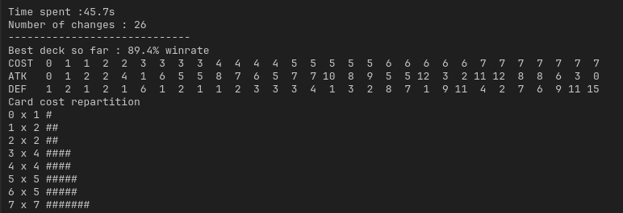
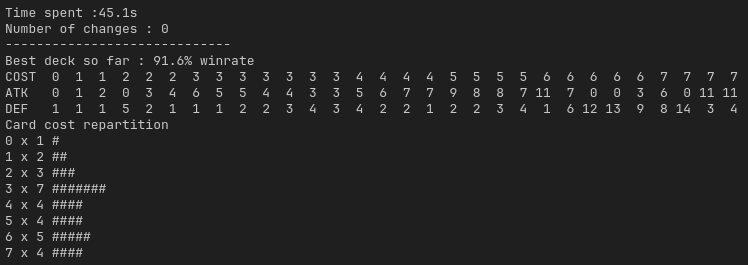
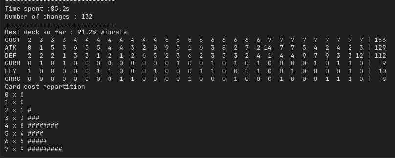
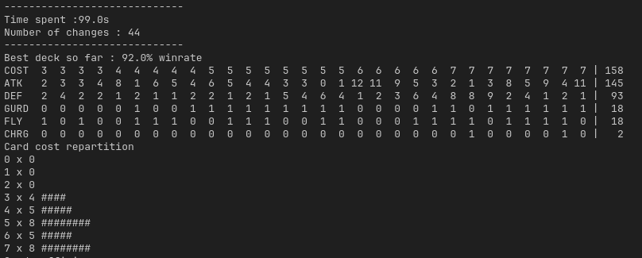

# enjmin card game

## Rules
**Player**
- HP 20
- 7 cards hand
- 30 cards deck
- 3 starting manas (+1 per turn) uncapped

**Cards**
- Cost
- Monster wait one turn before attacking
- ATK / DEF

**Game Rules**
- Draw a card
- Place costest cards first
- Cards always face (attacks enemy player)

**Cards**
- Cost : floor( (ATK + DEF) / 2.0 ) + skills cost
- Max cost : 6
- Skills:
  - Guard (opponent cards must attack this card)
  - Fly (pass guard, if opponent guarding card has not flying)
  - Charge (can attack when invoked)

## Steps:
- Basic learning : 1000 * 500 fight with substition, no skills
- Reinforcement learning : fight against same deck after reaching 90% WR
- Rated Setlist : Rate cards according to their impact in WR, priorize high rated cards when adding card to the deck 
- Setlist flag : Remove bad cards from base set list
- Genetic : Mutation + Crossover + Mutations
  
## Basic Learning
First 1000 iterations :

After 2000 iterations :

## Reinforcement Learning
Opponent deck copy player deck when winrate is over 95%, for 2000 iterations.
We observe a lot more changes happening during the simulation, and low cost cards are less present in the deck  

## Rated Setlist
We now rate added/removed cards according to their impact in win ratio.
Here is the result over 1000 iterations :

This system sometimes achieves 100% winrate in under 600 iterations, according to the opponent deck.