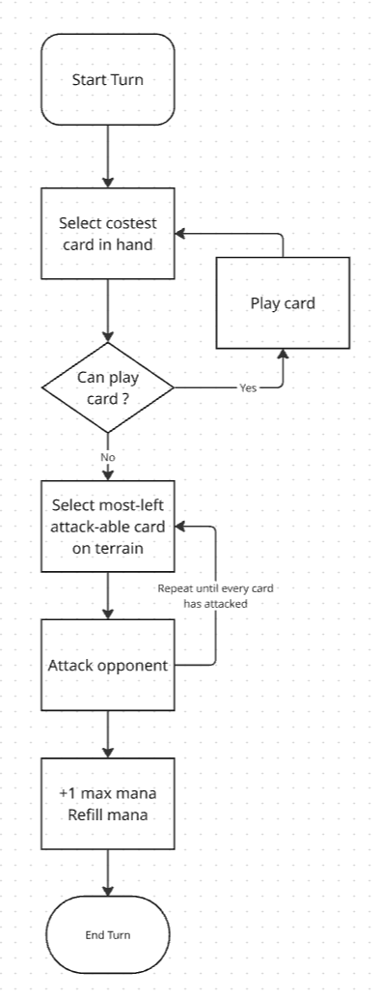
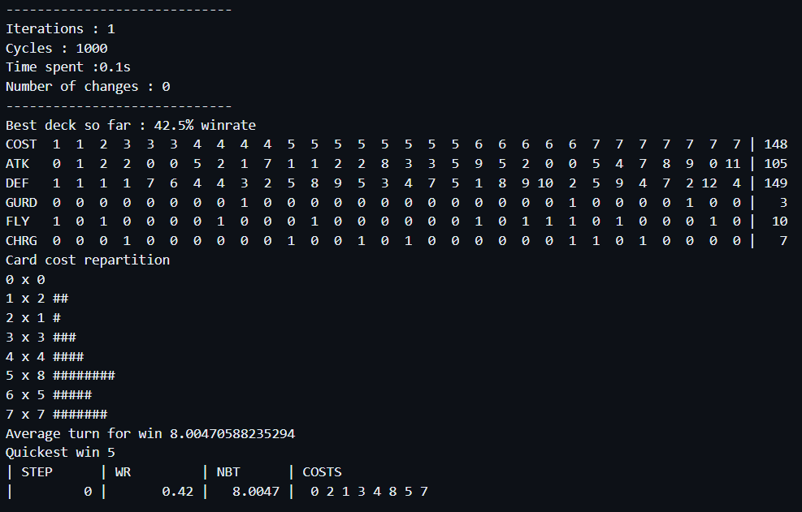
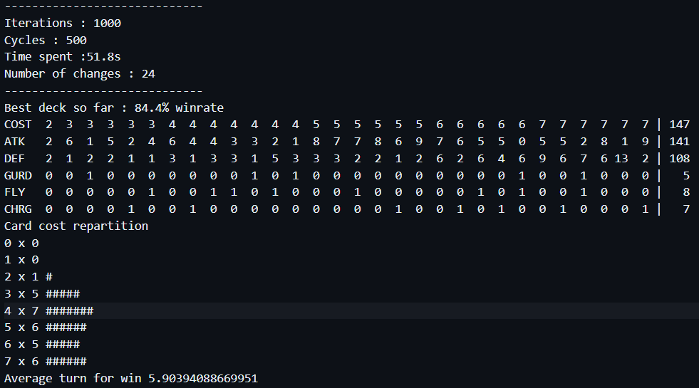
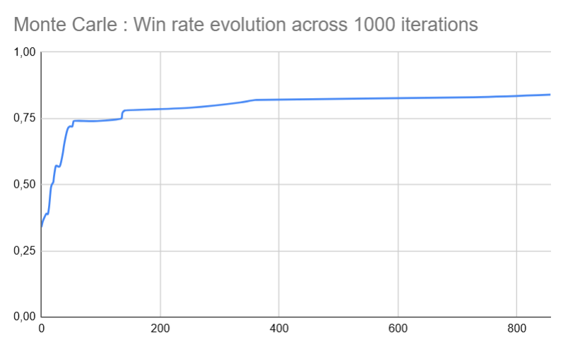
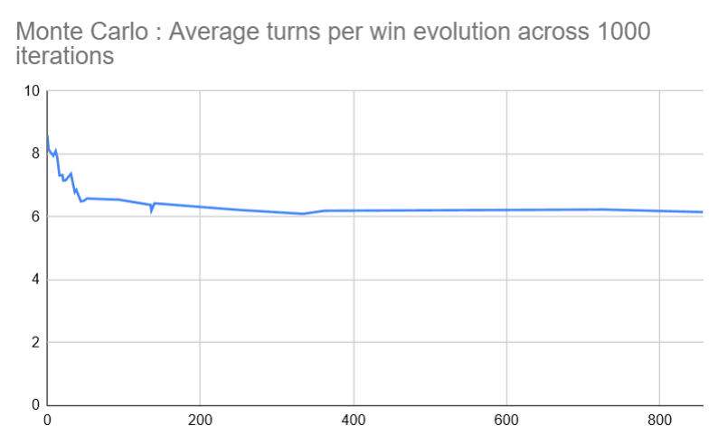
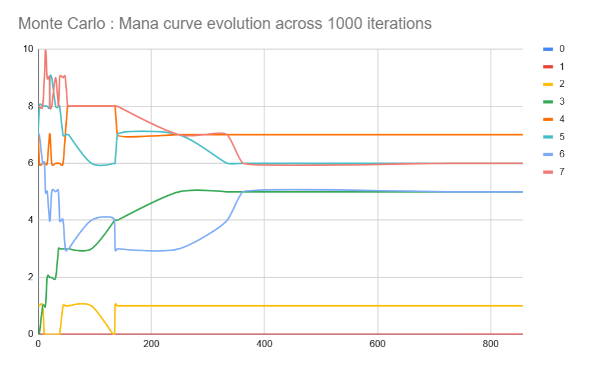
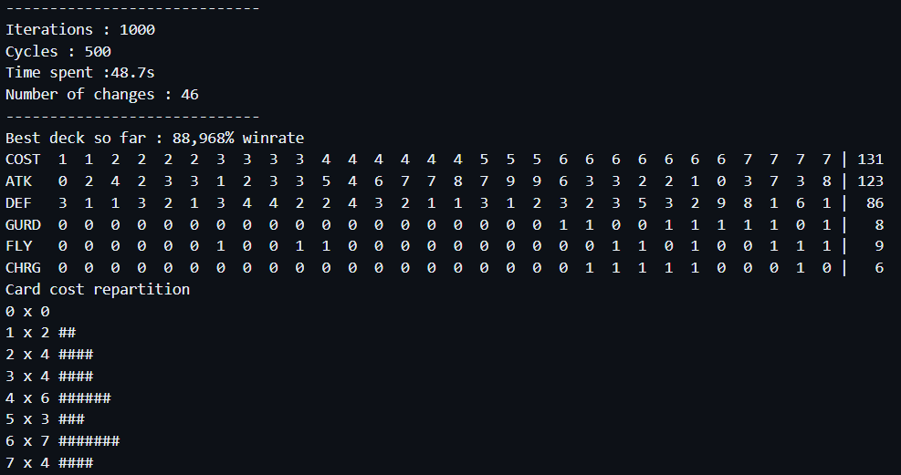
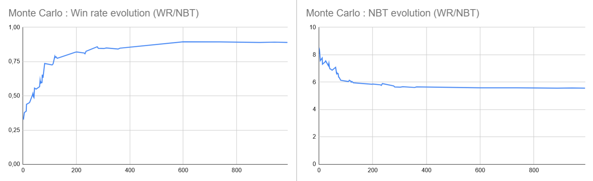
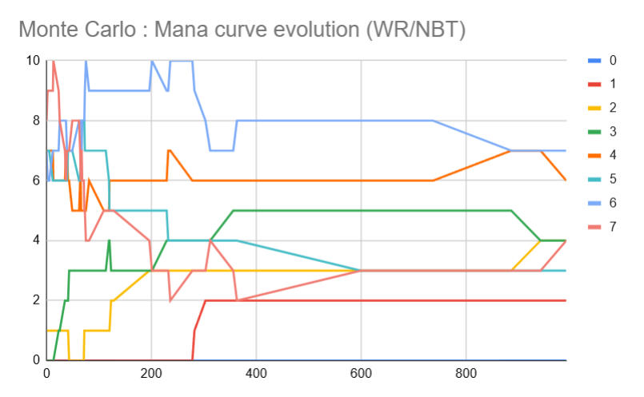

# enjmin card game

The objective of this experiment is to try out a variety of optimization techniques, and see how far we can push a card deck.  

- [enjmin card game](#enjmin-card-game)
- [Game Rules / Settings](#game-rules--settings)
  - [Player](#player)
  - [Cards](#cards)
  - [Game Rules](#game-rules)
  - [Cards](#cards-1)
  - [Step-by-step turn](#step-by-step-turn)
- [Approaches](#approaches)
- [Protocol](#protocol)
- [Starting Deck](#starting-deck)
- [Basic Learning / Monte Carlo](#basic-learning--monte-carlo)
  - [Win rate evolution](#win-rate-evolution)
  - [Number of turns](#number-of-turns)
  - [Mana curve](#mana-curve)
  - [Bonus: Impact of changing the rating score (WR/NBT rating)](#bonus-impact-of-changing-the-rating-score-wrnbt-rating)
- [Rated Setlist](#rated-setlist)
- [Reinforced training](#reinforced-training)
  - [Rapport](#rapport)

# Game Rules / Settings
## Player
- HP 20
- 7 cards hand
- 30 cards deck
- 3 starting manas (+1 per turn) uncapped

## Cards
- Cost
- Monster wait one turn before attacking
- ATK / DEF

## Game Rules
- Draw a card
- Place costest cards first
- Cards always face (attacks enemy player)

## Cards
- Cost : floor( (ATK + DEF) / 2.0 ) + skills cost
- Max cost : 6
- Skills:
  - Guard (opponent cards must attack this card)
  - Fly (pass guard, if opponent guarding card has not flying)
  - Charge (can attack when invoked)

## Step-by-step turn

# Approaches
- **Basic learning** : 1000 * 500 fight with substition, no skills
- **Reinforced training** : fight against same deck after reaching 90% WR
- **Rated Setlist** : Rate cards according to their impact in WR, priorize high rated cards when adding card to the deck 
- **Setlist flag** : Remove bad cards from base set list
- **Genetic** : Mutation + Crossover + Mutations

# Protocol
We will run 500 games per iterations, with 1000 iterations each time,
and will re-run iterations until the deck win-rate stabilizes.  

For each iteration, we will add a random card from the card pool and replace a random card from the deck. If the resulting win-rate beats the current reference deck win-rate score, the current deck becomes the reference deck.  

We will reuse the same decks to best compare our results across different techniques. 

For each improving iteration, we'll report the current iteration **count**, **win-rate**, **number of turn** (per win), and **mana curve**.

# Starting Deck
Starting decks will be selected in a setting where our improved deck (player 1) is at a low win-rate value.  

# Basic Learning / Monte Carlo
For the first approach, we will naively pick a random card each time.  
The deck obtained after 1000 iterations ends up with a 84% win-rate over 500 games.  

## Win rate evolution
The win-rate improves quickly and then stall at 75% win-rate around step 50.  

## Number of turns
The number of turns unsurprisingly follows the win-rate ratio and decrease over time as the deck improves.  

## Mana curve
The most remarkable changes were the increase of 3 mana cost cards, while decreasing 5-6 and 7 seven cost cards.  

## Bonus: Impact of changing the rating score (WR/NBT rating)
An important statistic in our simulation is the number of turn per win, aka the speed of our deck. We'll try to add this parameter in our simulation feedback loop, now basing our deck rating on `win_rate / avg_turn_per_win`.  

A direct result of entering a new parameter in the deck rating is a higher number of changes being accepted (46 changes against 24).  

Regarding win-rate and nbt curves, changes are more consistant than before, with multiple plateaus.  

Regarding mana curve, we end up with 1-2 and 3 cost cards being added to the deck.  

# Rated Setlist

We now rate added/removed cards according to their impact in win ratio.
Here is the result over 1000 iterations :

This system sometimes achieves 100% winrate in under 600 iterations, according to the opponent deck.

# Reinforced training
Opponent deck copy player deck when winrate is over 95%, for 2000 iterations.
We observe a lot more changes happening during the simulation, and low cost cards are less present in the deck  

## Rapport
- Description du protocole
- Résultats step by step / analytics
  - nombre de tour
  - distribution
  - durée de partie
- Analyse critique