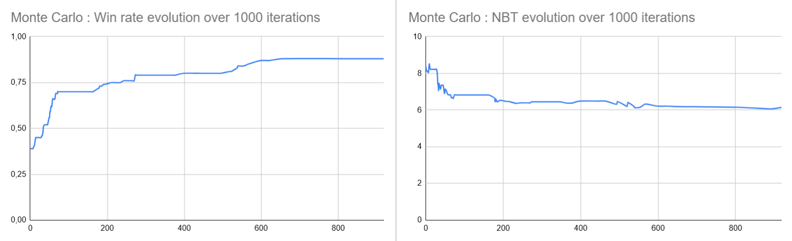
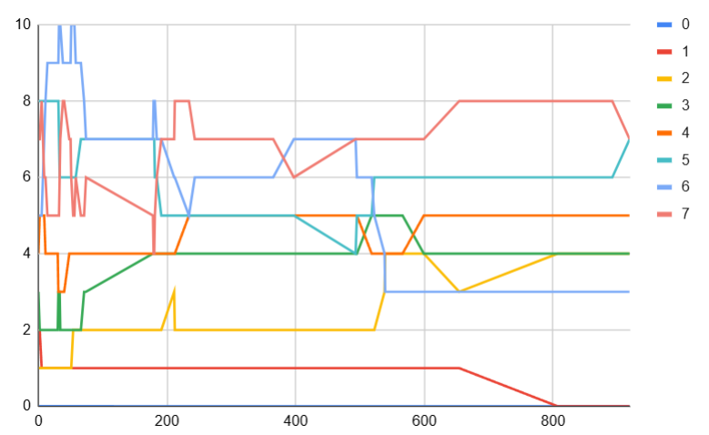
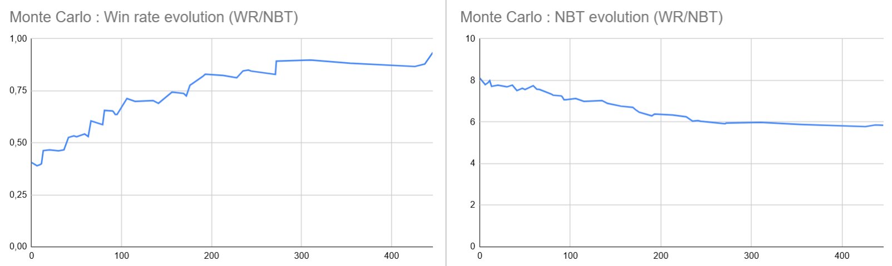
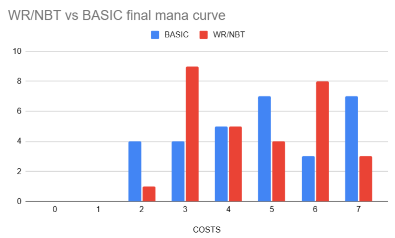
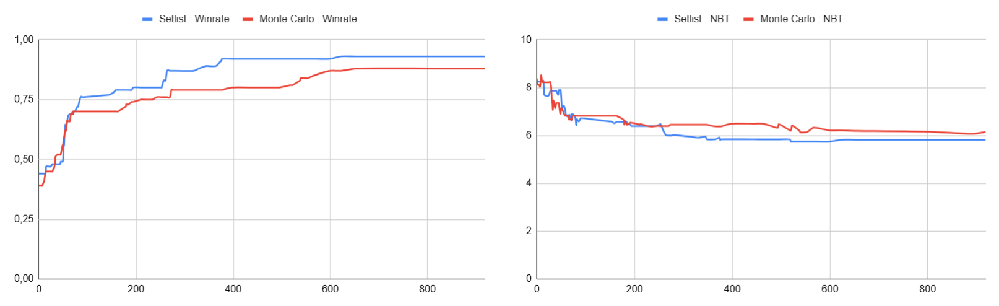
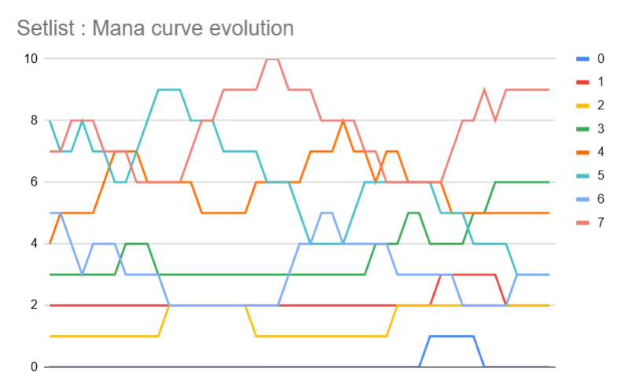
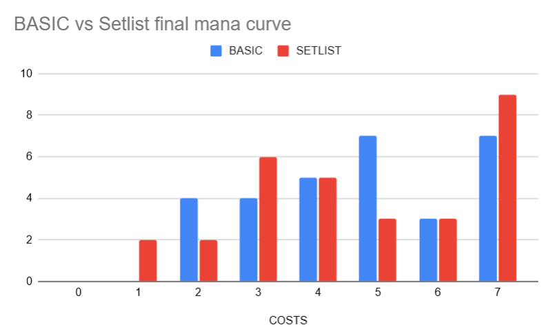
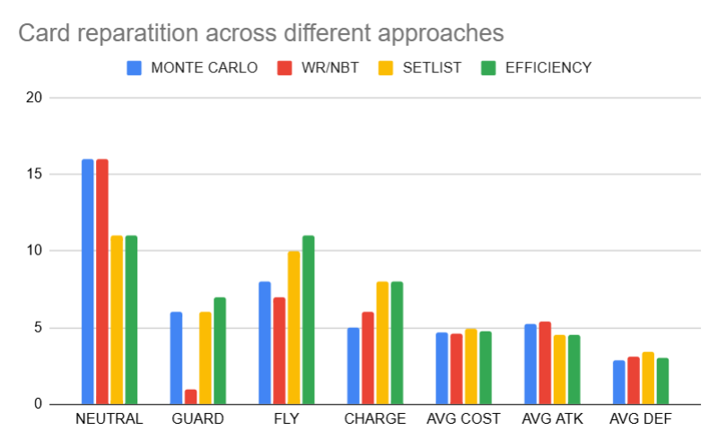
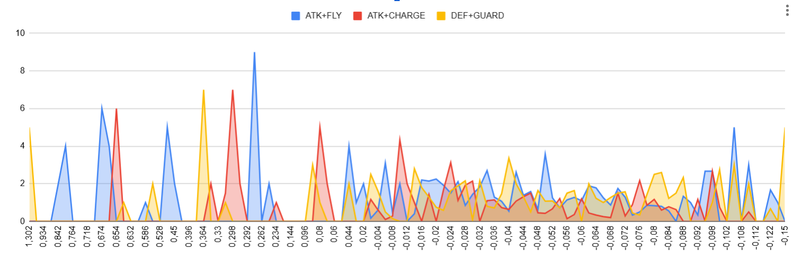
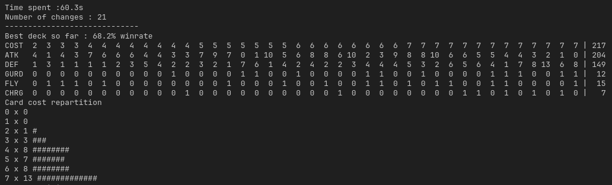

# enjmin card game

The objective of this experiment is to try out a variety of optimization techniques, and see how far we can push a card deck.  

- [enjmin card game](#enjmin-card-game)
- [Game Rules / Settings](#game-rules--settings)
  - [Player](#player)
  - [Cards](#cards)
  - [Game Rules](#game-rules)
  - [Cards](#cards-1)
  - [Step-by-step turn](#step-by-step-turn)
- [Approaches](#approaches)
- [Protocol](#protocol)
  - [Starting Deck](#starting-deck)
- [Basic Learning / Monte Carlo](#basic-learning--monte-carlo)
  - [Evolution over 1000 iterations](#evolution-over-1000-iterations)
    - [Win rate and average number of turn per win](#win-rate-and-average-number-of-turn-per-win)
    - [Mana curve](#mana-curve)
  - [Impact of changing the rating system (WR/NBT rating)](#impact-of-changing-the-rating-system-wrnbt-rating)
- [Rated Setlist](#rated-setlist)
  - [Evolution over 1000 iterations](#evolution-over-1000-iterations-1)
    - [Win rate and average number of turn per win](#win-rate-and-average-number-of-turn-per-win-1)
    - [Mana curve](#mana-curve-1)
  - [Cards efficiency](#cards-efficiency)
- [Conclusion / Critical analysis](#conclusion--critical-analysis)
  - [Card repartition](#card-repartition)
  - [Card efficiency](#card-efficiency)
- [Bonus : Turnament final fight](#bonus--turnament-final-fight)

# Game Rules / Settings
## Player
- HP 20
- 7 cards hand
- 30 cards deck
- 3 starting manas (+1 per turn) uncapped

## Cards
- Cost
- Monster wait one turn before attacking
- ATK / DEF

## Game Rules
- Draw a card
- Place costest cards first
- Cards always face (attacks enemy player)

## Cards
- Cost : floor( (ATK + DEF) / 2.0 ) + skills cost
- Max cost : 6
- Skills:
  - Guard (opponent cards must attack this card)
  - Fly (pass guard, if opponent guarding card has not flying)
  - Charge (can attack when invoked)


## Step-by-step turn


# Approaches
- **Basic learning** : 1000 * 500 fight with substition, no skills
- **Reinforced training** : fight against same deck after reaching 90% WR
- **Rated Setlist** : Rate cards according to their impact in WR, priorize high rated cards when adding card to the deck 
- **Setlist flag** : Remove bad cards from base set list
- **Genetic** : Mutation + Crossover + Mutations

# Protocol
We will run 500 games per iterations, with 1000 iterations each time,
and will re-run iterations until the deck win-rate stabilizes.  

For each iteration, we will add a random card from the card pool and replace a random card from the deck. If the resulting win-rate beats the current reference deck win-rate score, the current deck becomes the reference deck.  

We will reuse the same decks to best compare our results across different techniques. 

For each improving iteration, we'll report the current iteration **count**, **win-rate**, **number of turn** (per win), and **mana curve**.

## Starting Deck
Starting decks will be selected in a setting where our improved deck (player 1) is at a low win-rate value.  

```
-----------------------------
Iterations : 1
Cycles : 1000
Time spent :0.1s
Number of changes : 0
-----------------------------
Best deck so far : 42.5% winrate
COST  1  1  2  3  3  3  4  4  4  4  5  5  5  5  5  5  5  5  6  6  6  6  6  7  7  7  7  7  7  7 | 148
ATK   0  1  2  2  0  0  5  2  1  7  1  1  2  2  8  3  3  5  9  5  2  0  0  5  4  7  8  9  0 11 | 105
DEF   1  1  1  1  7  6  4  4  3  2  5  8  9  5  3  4  7  5  1  8  9 10  2  5  9  4  7  2 12  4 | 149
GURD  0  0  0  0  0  0  0  0  1  0  0  0  0  0  0  0  0  0  0  0  0  0  1  0  0  0  0  1  0  0 |   3
FLY   1  0  1  0  0  0  0  1  0  0  0  1  0  0  0  0  0  0  1  0  1  1  1  0  1  0  0  0  1  0 |  10
CHRG  0  0  0  1  0  0  0  0  0  0  1  0  0  1  0  1  0  0  0  0  0  0  1  1  0  1  0  0  0  0 |   7
Card cost repartition
0 x 0 
1 x 2 ##
2 x 1 #
3 x 3 ###
4 x 4 ####
5 x 8 ########
6 x 5 #####
7 x 7 #######
Average turn for win 8.00470588235294
```

# Basic Learning / Monte Carlo
For the first approach, we will naively pick a random card each time.  
The deck obtained after 1000 iterations ends up with a 84% win-rate over 500 games.  

```
-----------------------------
Iterations : 1000
Cycles : 500
Time spent :58.3s
Number of changes : 49
-----------------------------
Best deck so far : 88.0% winrate
COST  2  2  2  2  3  3  3  3  4  4  4  4  4  5  5  5  5  5  5  5  6  6  6  7  7  7  7  7  7  7 | 142
ATK   4  3  2  0  2  6  3  5  3  7  6  6  8  6  6  7  8  4  3  0  8 12  6  6  7  5  5  4 12  3 | 157
DEF   1  1  1  1  1  1  3  1  6  2  2  3  1  1  5  2  3  2  2  7  4  1  1  2  8  3  5  4  2 10 |  86
GURD  0  0  0  0  0  0  0  0  0  0  0  0  0  0  0  0  0  0  1  1  0  0  1  1  0  1  0  1  0  0 |   6
FLY   0  0  1  0  0  0  0  0  0  0  0  0  0  0  0  1  0  0  1  0  0  0  1  1  0  1  0  1  0  1 |   8
CHRG  0  0  0  1  1  0  0  0  0  0  0  0  0  1  0  0  0  1  0  0  0  0  0  0  0  0  1  0  0  0 |   5
Card cost repartition
0 x 0 
1 x 0 
2 x 4 ####
3 x 4 ####
4 x 5 #####
5 x 7 #######
6 x 3 ###
7 x 7 #######
Average turn for win 5.92105263157895
Quickest win 3
```

## Evolution over 1000 iterations
### Win rate and average number of turn per win
The win rate rises quickly in the first 70 steps then hit a first plateau at 70%.  
It then progress slowly to 88% at step 650.  

The average number of turn per win (NBT), follows the same trend and stale around 6 turns.



### Mana curve
Early trends shows an incrementation of 2 and 3 mana cards. Further trends stabilizing after 500 iterations are a decrease in 6 mana cards, and the complete removing of 1 cost cards.



## Impact of changing the rating system (WR/NBT rating)
An important statistic in our simulation is the number of turn per win, aka the speed of our deck. We'll try to add this parameter in our simulation feedback loop, now basing our deck rating on `win_rate / avg_turn_per_win`.  

A direct result of entering this new parameter is an increase of 3 mana cost cards.  

```
-----------------------------
Iterations : 1000
Cycles : 500
Time spent :60.2s
Number of changes : 41
-----------------------------
Best deck so far : 86.1294% winrate
COST  2  3  3  3  3  3  3  3  3  3  4  4  4  4  4  5  5  5  5  6  6  6  6  6  6  6  6  7  7  7 | 138
ATK   2  6  5  4  4  4  3  2  2  1  4  4  7  7  8  4 10  8  8 12 10  9  8  7  6  5  3  2  4  3 | 162
DEF   1  1  1  1  2  3  2  2  1  2  3  4  1  2  1  3  1  3  1  1  2  1  1  2  2  8 10 13 11  8 |  94
GURD  0  0  0  0  0  0  0  0  0  0  0  0  0  0  0  0  0  0  0  0  0  0  0  1  0  0  0  0  0  0 |   1
FLY   1  0  0  1  0  0  1  1  0  0  1  0  0  0  0  0  0  0  1  0  0  1  0  0  0  0  0  0  0  0 |   7
CHRG  0  0  0  0  0  0  0  0  1  1  0  0  0  0  0  1  0  0  0  0  0  0  1  0  1  0  0  0  0  1 |   6
Card cost repartition
0 x 0 
1 x 0 
2 x 1 #
3 x 9 #########
4 x 5 #####
5 x 4 ####
6 x 8 ########
7 x 3 ###
Average turn for win 5.6712962962963
Quickest win 3
```


Regarding win-rate and nbt curves, changes are more consistant than before, with multiple plateaus.  



Regarding mana curve, we end up with a lot more 3 mana cost cards in the deck.  




# Rated Setlist
We now rate added/removed cards according to their impact in win ratio.
Here is the result over 1000 iterations

This system sometimes achieves 100% winrate in under 600 iterations, according to the opponent deck.

```
-----------------------------
Iterations : 1000
Cycles : 500
Time spent :61.3s
Number of changes : 38
-----------------------------
Best deck so far : 88.8% winrate
COST  1  2  2  3  3  3  3  4  4  4  4  5  5  5  5  6  6  6  6  6  6  6  6  6  6  7  7  7  7  7 | 148
ATK   0  2  3  5  4  3  3  7  7  6  5  9  8  7  2  5  4  0  6  4  2  3  8  3  9  4  1  4  2 11 | 137
DEF   1  1  2  2  2  4  3  2  1  1  3  1  3  1  5  4  3 10  2  3  7  1  1  4  2  7  8  6  9  4 | 103
GURD  0  0  0  0  0  0  0  0  0  0  0  0  0  0  1  0  1  0  0  0  1  1  0  0  0  1  0  0  1  0 |   6
FLY   1  1  0  0  0  0  0  0  0  1  0  0  0  1  0  0  1  1  0  1  0  0  0  1  1  0  1  0  0  0 |  10
CHRG  0  0  0  0  0  0  0  0  0  0  0  0  0  0  0  1  0  0  1  1  0  1  1  1  0  0  1  1  0  0 |   8
Card cost repartition
0 x 0 
1 x 1 #
2 x 2 ##
3 x 4 ####
4 x 4 ####
5 x 4 ####
6 x 10 ##########
7 x 5 #####
Average turn for win 5.8649885583524
Quickest win 5
```

## Evolution over 1000 iterations
### Win rate and average number of turn per win
The win rate rises quickly in the first 70 steps then hit a first plateau at 70%.  
It then progress slowly to 88% at step 650.  

The average number of turn per win (NBT), follows the same trend and stale around 6 turns.



### Mana curve
Early trends shows an incrementation of 2 and 3 mana cards. Further trends stabilizing after 500 iterations are a decrease in 6 mana cards, and the complete removing of 1 cost cards.



The setlist mana curve evolution trend is similar to our first implementation, with lots of 7 cost cards added to the deck.



## Cards efficiency
Why not use most efficient cards as a starting point for our deck ?  
We will try this new deck against our **Setlist** final deck :

```
-----------------------------
Iterations : 1
Cycles : 500
Time spent :0.0s
Number of changes : 0
-----------------------------
Best deck so far : 56.4% winrate
COST  1  2  2  3  3  3  3  3  4  4  4  4  4  5  5  5  6  6  6  6  6  6  6  6  6  6  7  7  7  7 | 143
ATK   0  2  3  5  4  4  3  3  3  7  7  6  5  9  8  7  9  8  6  5  5  4  4  2  3  3  1  2  4  3 | 135
DEF   1  1  2  2  2  3  3  4  2  1  2  1  3  1  3  1  2  1  2  4  2  3  3  7  4  1  8  9  7  5 |  90
GURD  0  0  0  0  0  0  0  0  0  0  0  0  0  0  0  0  0  0  0  0  1  0  1  1  0  1  0  1  1  1 |   7
FLY   1  1  0  0  0  0  0  0  0  0  0  1  0  0  0  1  1  0  0  0  1  1  1  0  1  0  1  0  0  1 |  11
CHRG  0  0  0  0  0  0  0  0  1  0  0  0  0  0  0  0  0  1  1  1  0  1  0  0  1  1  1  0  0  0 |   8
Card cost repartition
0 x 0 
1 x 1 #
2 x 2 ##
3 x 5 #####
4 x 5 #####
5 x 3 ###
6 x 10 ##########
7 x 4 ####
Average turn for win 5.31560283687943
Quickest win 5
```

A test run against our starting deck show few improvements in terms of win rate compared to the setlist approach :

```Iterations : 1
Cycles : 1000
Time spent :0.1s
Number of changes : 0
-----------------------------
Best deck so far : 90.5% winrate
COST  1  2  2  3  3  3  3  3  4  4  4  4  4  5  5  5  6  6  6  6  6  6  6  6  6  6  7  7  7  7 | 143
ATK   0  2  3  3  3  4  4  5  7  7  6  3  5  9  8  7  4  4  5  5  6  3  3  2  8  9  4  3  2  1 | 135
DEF   1  1  2  4  3  3  2  2  1  2  1  2  3  1  3  1  3  3  4  2  2  4  1  7  1  2  7  5  9  8 |  90
GURD  0  0  0  0  0  0  0  0  0  0  0  0  0  0  0  0  1  0  0  1  0  0  1  1  0  0  1  1  1  0 |   7
FLY   1  1  0  0  0  0  0  0  0  0  1  0  0  0  0  1  1  1  0  1  0  1  0  0  0  1  0  1  0  1 |  11
CHRG  0  0  0  0  0  0  0  0  0  0  0  1  0  0  0  0  0  1  1  0  1  1  1  0  1  0  0  0  0  1 |   8
Card cost repartition
0 x 0 
1 x 1 #
2 x 2 ##
3 x 5 #####
4 x 5 #####
5 x 3 ###
6 x 10 ##########
7 x 4 ####
Average turn for win 5.96022099447514
Quickest win 5
| STEP      | WR         | NBT      | COSTS
|         0 |       0.91 |   5.9602 |  0 1 2 5 5 3 10 4
```

# Conclusion / Critical analysis

Overall the best results were obtained using the **Setlist**, but we can see similar trends emerging in our different approaches.

## Card repartition

Our card efficiency based approaches tends to eliminate more neutral cards (cards with no skills) than **Monte Carlo**.

Despite the chosen approach, **FLYING** seems overpowered, as nearly half cards in decks use it.  



## Card efficiency

An interesting trend showed by rating cards efficiency is a relation between **ATK** with **FLYING** and **CHARGE**, and **DEF** with **GUARD** in the card picks.

*From left to right, high rated to low rated cards, y axis is the corresponding average ATK/DEF values*




# Bonus : Turnament final fight
Here is a screen of the last fight in the turnament.  
Deck was using the **Setlist** approach and trained against itself multiple times, `5 x 1000 iterations x 500 cycles`.

