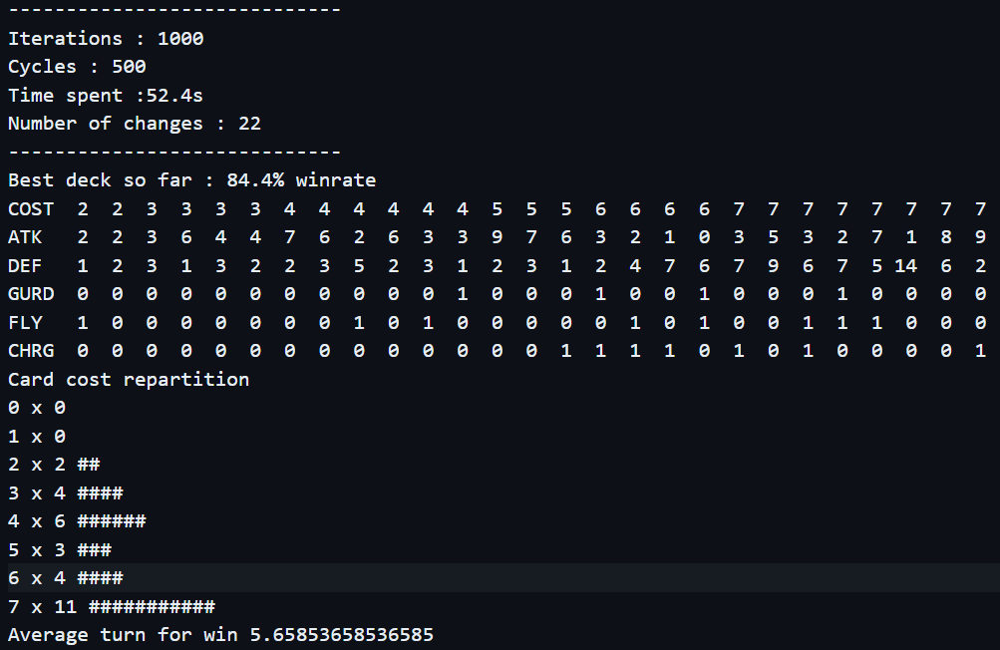
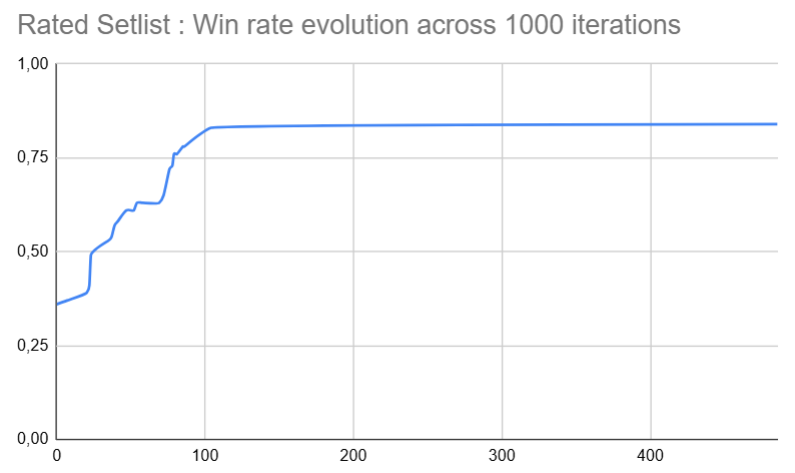
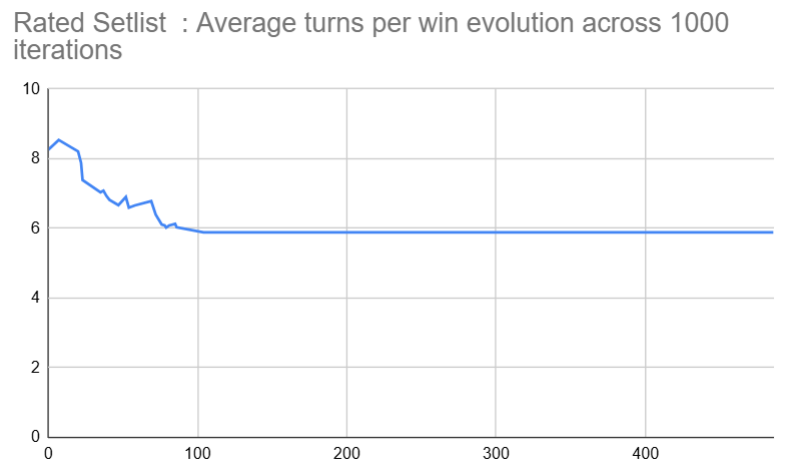

# enjmin card game

## Goal
The objective of this experiment is to try out a variety of optimization techniques, and see how far we can push a card deck 

## Approaches
- **Basic learning** : 1000 * 500 fight with substition, no skills
- **Reinforced training** : fight against same deck after reaching 90% WR
- **Rated Setlist** : Rate cards according to their impact in WR, priorize high rated cards when adding card to the deck 
- **Setlist flag** : Remove bad cards from base set list
- **Genetic** : Mutation + Crossover + Mutations

## Protocol
We will run 500 games per iterations, with 1000 iterations each time,
and will re-run iterations until the deck win-rate stabilizes.  

We will reuse the same decks to best compare our results across different techniques. 

For each improving iteration, we'll report the current iteration **count**, **win-rate**, **number of turn** (per win only), and **mana curve**.

### Game Rules / Settings
**Player**
- HP 20
- 7 cards hand
- 30 cards deck
- 3 starting manas (+1 per turn) uncapped

**Cards**
- Cost
- Monster wait one turn before attacking
- ATK / DEF

**Game Rules**
- Draw a card
- Place costest cards first
- Cards always face (attacks enemy player)

**Cards**
- Cost : floor( (ATK + DEF) / 2.0 ) + skills cost
- Max cost : 6
- Skills:
  - Guard (opponent cards must attack this card)
  - Fly (pass guard, if opponent guarding card has not flying)
  - Charge (can attack when invoked)

## Starting Deck
Starting decks will be selected in a setting where our improved deck (player 1) is at a low win-rate value.  

## Basic Learning / Monte Carlo

## Rated Setlist

We now rate added/removed cards according to their impact in win ratio.
Here is the result over 1000 iterations :
<!--  -->

This system sometimes achieves 100% winrate in under 600 iterations, according to the opponent deck.

## Reinforced training
Opponent deck copy player deck when winrate is over 95%, for 2000 iterations.
We observe a lot more changes happening during the simulation, and low cost cards are less present in the deck  

### Rapport
- Description du protocole
- Résultats step by step / analytics
  - nombre de tour
  - distribution
  - durée de partie
- Analyse critique